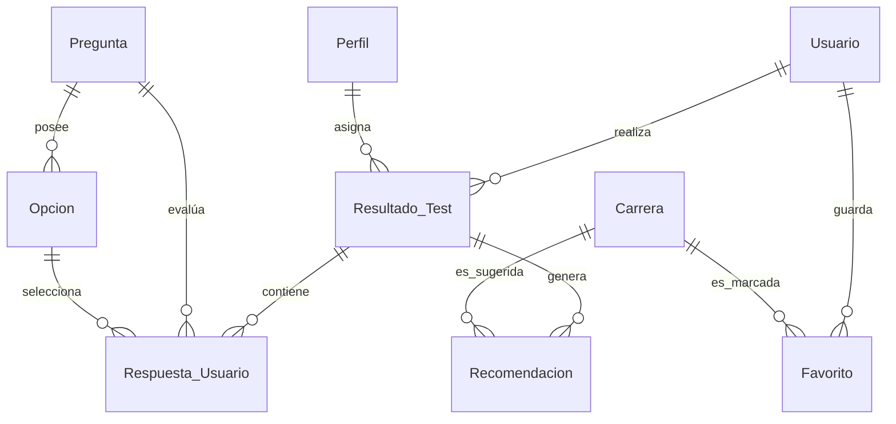

# 📊 CareerPathDB - Base de Datos

## Descripción
La base de datos **CareerPathDB** fue creada para almacenar y gestionar toda la información requerida por la base de datos para el funcionamiento de *CareerPath*. Su objetivo principal es administrar usuarios, pruebas vocacionales, recomendaciones, historial de resultados y preferencias, así como carreras profesionales, asegurando la integridad, la consistencia y la escalabilidad de los datos.
---

##  Objetivos del Sistema
* **Almacenar** Almacena información detallada de los usuarios registrados.
* **Gestionar** Gestiona el banco de preguntas y las multiples opciones del test vocacional.
* **Calcular** Calcula y persiste de forma exacta los resultados de las pruebas.
* **Relacionar** Relaciones de perfiles vocacionales específicos con carreras profesionales compatibles con los usuarios.
* **Registrar** Registra las recomendaciones personalizadas basadas en algoritmos de afinidad.
* **Administrar** Administra el historial de actividad y las carreras favoritas de los usuarios.

---

##  Herramientas 

* **Motor de base de datos:** Se emplea MySQL Server 8.0 (con funciones avanzadas de optimización e indexación).
* **Modelado y administración:** MySQL Workbench (realización de consultas SQL y diseño EER).
* **Desarrollo:** Visual Studio Code (redacción de scripts para la migración e inicialización).
* **Control de versiones**: Git y GitHub (monitoreo de las modificaciones en los scripts .sql).

---

##  Modelo Relacional (De la siguiente manera estara estructurada la base de datos)

### Usuario (Usuario)

| Campo | Tipo de datos | Características | Detalles |
| :--- | :--- | :--- | :--- |
| `id_usuario` | INT | AUTO_INCREMENT | Es el ID individual de los usuario. |
| `nombre` | VARCHAR(100) | NOT NULL | Nombre(s) del usuario. |
| `apellido` | VARCHAR(100) | NOT NULL | Apellido(s) del usuario. |
| `correo` | VARCHAR(150) | NOT NULL, ÚNICO | Correo electrónico para el inicio de sesión. |
| `contraseña` | VARCHAR(255) | NOT NULL | Manejo de  contraseñas. |
| `rol` | ENUM('USER', 'ADMIN') | NOT NULL | Rol utilizado para el control de accesos de los usuarios . |
| `fecha_registro` | DATETIME | DEFAULT CURRENT_TIMESTAMP | Crea una fecha automática al momento en que se creó la cuenta. |

### Carrera (`Carreras`)

| Campo | Tipo de datos | Características | Detalles |
| :--- | :--- | :--- | :--- |
| `id_carrera` | INT | AUTO_INCREMENT | Es el identificador de la carrera. |
| `nombre` | VARCHAR(150) | NOT NULL | Título oficial de la profesión. |
| `descripcion` | TEXT |  | Descripción general del perfil profesional . |
| `duracion` | VARCHAR(50) | NOT NULL | Periodo de tiempo previsto (por ejemplo: "10 semestres", "5 años", lo que el usuario ingrese ). |
| `modalidad` | VARCHAR(50) | NOT NULL | Modalidad de estudio (virtual, presencial o híbrida).|
| `habilidades_requeridas` | TEXTO | NOT NULL | Capacidades que se requieren para la carrera. |
| `areas_trabajo` | TEXTO | NOT NULL | Campos o sectores de trabajo. |
| `salario_promedio` | DECIMAL(10,2) | NOT NULL | Ingreso calculado en el mercado local. |

###  Perfil vocacional (`Perfiles`)

| Campo | Tipo de datos | Características | Detalles |
| :--- | :--- | :--- | :--- |
| `id_perfil`  | INT | AUTO_INCREMENT | Es el identifiacor que identifica la clase de perfil. |
| `nombre` | VARCHAR(100) | NO NULO | Tipo de vocación (por ejemplo, artístico o tecnológico).|
| `descripcion` | TEXT | NOT NULL | Características distintivas de este tipo de perfil. |

###  Pregunta (Preguntas)

| Campo | Tipo de datos | Características | Detalles |
| :--- | :--- | :--- | :--- |
| `id_pregunta`  | INT | AUTO_INCREMENT | Código que identifica la pregunta. |
| `pregunta` | TEXT | NOT NULL | Redacción evaluativa del examen. |

### Opción de respuesta (Opciones)

| Campo | Tipo de datos | Características | Detalles |
| :--- | :--- | :--- | :--- |
| `id_opcion` | INT | AUTO_INCREMENT | Es el identificador de la opción. |
| `id_pregunta` | INT | NOT NULL (FK) | Se refiere a la pregunta original. |
| `texto_opcion` | VARCHAR(255) | NOT NULL | Respuesta que puede ver el usuario. |
| `puntaje` | INT | NOT NULL | Peso numérico que se le asigna a cada opción. |

### Resultado de la prueba ("Resultado del Test")

| Campo | Tipo de datos | Características | Detalles |
| :--- | :--- | :--- | :--- |
| `id_resultado` | INT | AUTO_INCREMENT | El identificador de la entrada del resultado. |
| `id_usuario` | INT | NOT NULL (FK) | El usuario que realizó la prueba. |
| `id_perfil` | INT | NO NULO (FK) | Perfil dominante que se ha adquirido. |
| `porcentaje_afinidad`| DECIMAL(5,2) | NOT NULL | Mide el grado de coincidencia con el perfil (0-100%). |
| `explicacion` | TEXTO | NOT NULL | Retroalimentación particularizada del resultado. |
| `fecha` | DATETIME | DEFAULT CURRENT_TIMESTAMP | Fecha en la que se llevó a cabo el examen (AUTOMATICA). |

### Respuesta almacenada (`Respuesta de los Usuario`)

| Campo | Tipo de datos | Características | Detalles |
| :--- | :--- | :--- | :--- |
| `id_respuesta` | INT | AUTO_INCREMENT | Clave única que identifica el registro de respuesta. |
| `id_resultado` | INT | NOT NULL (FK) | El test al que la respuesta corresponde. |
| `id_pregunta` | INT | NOT NULL (FK) | Pregunta que ha sido contestada. |
| `id_opcion` | INT | NOT NULL (FK) | Opción que seleccionó el usuario. |

### Sugerencia (`Recomendacion`)

| Campo | Tipo de datos | Características | Detalles |
| :--- | :--- | :--- | :--- |
| `id_recomendacion`  | INT | AUTO_INCREMENT | Número de identificación de la sugerencia producida. |
| `id_resultado`  | INT | NOT NULL (FK) | Examen que activa la sugerencia. |
| `id_carrera`  | INT | NOT NULL (FK) | Carrera recomendada para el usuario. |
| `porcentaje` | DECIMAL(ejemplo: 5,2) | NOT NULL | Concordancia particular con la profesión. |

### Preferido (`Favorito`)

| Campo | Tipo de datos | Características | Detalles |
| :--- | :--- | :--- | :--- |
| `id_favorito`  | INT | AUTO_INCREMENT | Es el código que identifica al marcador favorito. |
| `id_usuario`  | INT | NOT NULL (FK) | El usuario que almacena la carrera. |
| `id_carrera`  | INT | NOT NULL (FK) | Carrera que se guarda como favorita. |

---

## 🔗 Diagrama de Relaciones e Integridad Referencial

A continuación se detalla la lógica de vinculación entre componentes mediante llaves foráneas, utilizando mermaid como inteligencia artificial ayudante para crear el diagrama (`FOREIGN KEY`):

### Resumen de Mapeo de Restricciones
* **`PRIMARY KEY`**: Aplicado en todos los campos `id_*` de manera numérica indexada de tipo entero.
* **`NOT NULL`**: Forzado en campos operacionales para evitar anomalías o vacíos en reportes de afinidad.
* **`UNIQUE`**: Restricción explícita en `Usuario.correo` para mitigar cuentas duplicadas.

---

## Normalización

El diseño lógico de la base de datos se ha creado siguiendo los preceptos de la **Tercera Forma Normal (3FN)**:
1. **1FN (Primera Forma Normal):** Se han suprimido los conjuntos repetidos; cada celda alberga solamente valores atómicos independientes.
2. **2FN (Segunda Forma Normal):** Se suprimieron las dependencias parciales. Las columnas que no pertenecen a las llaves dependen funcionalmente de forma total de sus respectivas llaves primarias.
3. **3FN (Tercera Forma Normal):** Las dependencias transitivas fueron eliminadas. Las columnas no clave se establecen específicamente en relación con la llave primaria, no por medio de campos intermedios (por ejemplo, separando preguntas y opciones en entidades desacopladas).

---

## Normas de negocio que se han puesto en marcha

1. **Pruebas históricas:** Un usuario tiene la posibilidad de realizar el test en varias ocasiones para analizar cómo han cambiado sus intereses.
2. **Resultados atómicos:** Cada vez que se realiza un test, se crea un registro cerrado y único de los resultados.
3. **Recomendación múltiple:** Un solo resultado es capaz de procesar y proponer una lista dinámica de múltiples carreras profesionales al mismo tiempo.
4. **Relación de favoritos N:M:** Un usuario puede marcar varias carreras como sus favoritas, mientras que una sola carrera puede estar en las listas de favoritos de miles de usuarios. (Esto se soluciona por medio de la tabla intermedia llamada `Favorito`.)
5. **Consistencia de las respuestas:** Las alternativas del test están estrictamente vinculadas a su pregunta matriz, lo que garantiza que el usuario solo conserve opciones válidas en el flujo.
6. **Seguridad de los accesos (RBAC):** Los usuarios que tienen el valor "ADMIN" en la columna "rol" son los únicos que cuentan con privilegios para actualizar, borrar o insertar datos en el catálogo de "Carrera" y "Pregunta".

---

##  Futuras Mejoras Tecnológicas que se podrian aplicar ( es opcional y situacional si se requiere )
* **Capa de inteligencia artificial:** Diseño de tablas vectoriales y triggers para incorporar motores de recomendación fundamentados en modelos LLM y embeddings.
* **Módulo analítico (OLAP):** Para crear estadísticas globales y dashboards administrativos de forma rápida, se utilizan procedimientos almacenados y vistas indexadas. ( permite analizar grandes volumenes de datos )
* **Sincronización académica:** Extensión del esquema para enlazar convenios directos de admisión y entradas con bases de datos de universidades ajenas.
---

##  Información del Proyecto
* **Versión del Esquema:** v1.0
* **Entorno:** Producción / Desarrollo - Proyecto Integrador *CareerPath*
* **Tipo:** Base de Datos Relacional (RDBMS) - MySQL 8.0
