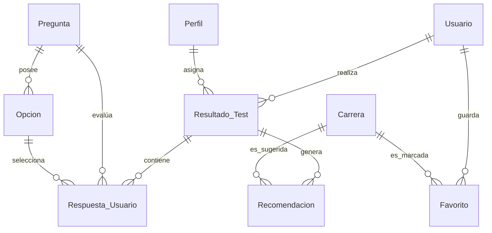

# 📊 CareerPathDB - Base de Datos

## Descripción
La base de datos **CareerPathDB** fue creada para almacenar y gestionar toda la información requerida por la base de datos para el funcionamiento de *CareerPath*. Su objetivo principal es administrar usuarios, pruebas vocacionales, recomendaciones, historial de resultados y preferencias, así como carreras profesionales, asegurando la integridad, la consistencia y la escalabilidad de los datos.
---

##  Objetivos del Sistema
* **Almacenar** Almacena información detallada de los usuarios registrados.
* **Gestionar** Gestiona el banco de preguntas y las multiples opciones del test vocacional.
* **Calcular** Calcula y persiste de forma exacta los resultados de las pruebas.
* **Relacionar** Relaciones de perfiles vocacionales específicos con carreras profesionales compatibles con los usuarios.
* **Registrar** Registra las recomendaciones personalizadas basadas en algoritmos de afinidad.
* **Administrar** Administra el historial de actividad y las carreras favoritas de los usuarios.

---

##  Herramientas 

* **Motor de base de datos:** Se emplea MySQL Server 8.0 (con funciones avanzadas de optimización e indexación).
* **Modelado y administración:** MySQL Workbench (realización de consultas SQL y diseño EER).
* **Desarrollo:** Visual Studio Code (redacción de scripts para la migración e inicialización).
* **Control de versiones**: Git y GitHub (monitoreo de las modificaciones en los scripts .sql).

---

##  Modelo Relacional (De la siguiente manera estara estructurada la base de datos)

### Usuario (Usuario)

| Campo | Tipo de datos | Características | Detalles |
| :--- | :--- | :--- | :--- |
| `id_usuario` | INT | AUTO_INCREMENT | Es el ID individual de los usuario. |
| `nombre` | VARCHAR(100) | NOT NULL | Nombre(s) del usuario. |
| `apellido` | VARCHAR(100) | NOT NULL | Apellido(s) del usuario. |
| `correo` | VARCHAR(150) | NOT NULL, ÚNICO | Correo electrónico para el inicio de sesión. |
| `contraseña` | VARCHAR(255) | NO NULO | Manejo de  contraseñas. |
| `rol` | ENUM('USER', 'ADMIN') | NOT NULL | Rol utilizado para el control de accesos de los usuarios . |
| `fecha_registro` | DATETIME | DEFAULT CURRENT_TIMESTAMP | Crea una fecha automática al momento en que se creó la cuenta. |

###  Carrera (`Carrera`)

| Campo | Tipo de Datos | Atributos | Descripción |
| :--- | :--- | :--- | :--- |
| `id_carrera`  | INT | AUTO_INCREMENT | Identificador de la carrera. |
| `nombre` | VARCHAR(150) | NOT NULL | Nombre oficial de la profesión. |
| `descripcion` | TEXT | NOT NULL | Detalles generales del perfil profesional. |
| `duracion` | VARCHAR(50) | NOT NULL | Tiempo estimado (ej: "5 años", "10 semestres").|
| `modalidad` | VARCHAR(50) | NOT NULL | Formato de estudio (Presencial, Virtual, Híbrido).|
| `habilidades_requeridas`| TEXT | NOT NULL | Competencias necesarias para la carrera. |
| `areas_trabajo` | TEXT | NOT NULL | Campos o sectores de salida laboral. |
| `salario_promedio`| DECIMAL(10,2)| NOT NULL | Ingreso estimado en el mercado local. |

### 🎭 Perfil Vocacional (`Perfil`)

| Campo | Tipo de Datos | Atributos | Descripción |
| :--- | :--- | :--- | :--- |
| `id_perfil` 🔑 | INT | AUTO_INCREMENT | Identificador del tipo de perfil. |
| `nombre` | VARCHAR(100) | NOT NULL | Categoría vocacional (ej: Tecnológico, Artístico).|
| `descripcion` | TEXT | NOT NULL | Rasgos característicos de este tipo de perfil. |

### ❓ Pregunta (`Pregunta`)

| Campo | Tipo de Datos | Atributos | Descripción |
| :--- | :--- | :--- | :--- |
| `id_pregunta` 🔑 | INT | AUTO_INCREMENT | Identificador de la pregunta. |
| `pregunta` | TEXT | NOT NULL | Enunciado evaluativo del test. |

### 🔘 Opcíon de Respuesta (`Opcion`)

| Campo | Tipo de Datos | Atributos | Descripción |
| :--- | :--- | :--- | :--- |
| `id_opcion` 🔑 | INT | AUTO_INCREMENT | Identificador de la opción. |
| `id_pregunta` 🔗 | INT | NOT NULL (FK) | Vinculación a la pregunta origen. |
| `texto_opcion` | VARCHAR(255) | NOT NULL | Respuesta visible para el usuario. |
| `puntaje` | INT | NOT NULL | Peso numérico asignado a la opción. |

### 📝 Resultado del Test (`Resultado_Test`)

| Campo | Tipo de Datos | Atributos | Descripción |
| :--- | :--- | :--- | :--- |
| `id_resultado` 🔑 | INT | AUTO_INCREMENT | Identificador del registro del resultado. |
| `id_usuario` 🔗 | INT | NOT NULL (FK) | Usuario que ejecutó la prueba. |
| `id_perfil` 🔗 | INT | NOT NULL (FK) | Perfil dominante obtenido. |
| `porcentaje_afinidad`| DECIMAL(5,2)| NOT NULL | Nivel de coincidencia con el perfil (0-100%). |
| `explicacion` | TEXT | NOT NULL | Feedback personalizado del resultado. |
| `fecha` | DATETIME | DEFAULT CURRENT_TIMESTAMP | Fecha de realización del test. |

### 📥 Respuesta Guardada (`Respuesta_Usuario`)

| Campo | Tipo de Datos | Atributos | Descripción |
| :--- | :--- | :--- | :--- |
| `id_respuesta` 🔑 | INT | AUTO_INCREMENT | Identificador único del registro de respuesta. |
| `id_resultado` 🔗 | INT | NOT NULL (FK) | Test al que pertenece la respuesta. |
| `id_pregunta` 🔗 | INT | NOT NULL (FK) | Pregunta respondida. |
| `id_opcion` 🔗 | INT | NOT NULL (FK) | Opción seleccionada por el usuario. |

### 💡 Recomendación (`Recomendacion`)

| Campo | Tipo de Datos | Atributos | Descripción |
| :--- | :--- | :--- | :--- |
| `id_recomendacion` 🔑| INT | AUTO_INCREMENT | Identificador de la recomendación generada. |
| `id_resultado` 🔗 | INT | NOT NULL (FK) | Test que dispara la recomendación. |
| `id_carrera` 🔗 | INT | NOT NULL (FK) | Carrera sugerida al usuario. |
| `porcentaje` | DECIMAL(5,2)| NOT NULL | Compatibilidad específica con la carrera. |

### ⭐ Favorito (`Favorito`)

| Campo | Tipo de Datos | Atributos | Descripción |
| :--- | :--- | :--- | :--- |
| `id_favorito` 🔑 | INT | AUTO_INCREMENT | Identificador del marcador favorito. |
| `id_usuario` 🔗 | INT | NOT NULL (FK) | Usuario que guarda la carrera. |
| `id_carrera` 🔗 | INT | NOT NULL (FK) | Carrera guardada como favorita. |

---

## 🔗 Diagrama de Relaciones e Integridad Referencial

A continuación se detalla la lógica de vinculación entre componentes mediante llaves foráneas (`FOREIGN KEY`):

### Resumen de Mapeo de Restricciones
* **`PRIMARY KEY`**: Aplicado en todos los campos `id_*` de manera numérica indexada de tipo entero.
* **`NOT NULL`**: Forzado en campos operacionales para evitar anomalías o vacíos en reportes de afinidad.
* **`UNIQUE`**: Restricción explícita en `Usuario.correo` para mitigar cuentas duplicadas.

---

## 📐 Normalización

El diseño lógico de la base de datos se ha desarrollado bajo los estándares de la **Tercera Forma Normal (3FN)**:
1. **1FN (Primera Forma Normal):** Se eliminaron los grupos repetitivos; cada celda contiene únicamente valores atómicos independientes.
2. **2FN (Segunda Forma Normal):** Se eliminaron las dependencias parciales. Todas las columnas que no forman parte de las llaves dependen funcionalmente de manera completa de sus respectivas llaves primarias.
3. **3FN (Tercera Forma Normal):** Se eliminaron las dependencias transitivas. Las columnas no clave se definen estrictamente en función de la llave primaria y no a través de campos intermedios (ej: aislando opciones y preguntas en entidades desacopladas).

---

## 💼 Reglas de Negocio Implementadas

1. **Pruebas históricas:** Un usuario puede tomar el test múltiples veces para evaluar la evolución de sus intereses.
2. **Resultados atómicos:** Cada intento o ejecución de un test genera un registro único y cerrado de resultados.
3. **Recomendación múltiple:** Un solo resultado puede procesar y sugerir un listado dinámico de varias carreras profesionales simultáneamente.
4. **Relación de Favoritos N:M:** Un usuario marca múltiples carreras favoritas, y una carrera puede pertenecer a las listas de favoritos de miles de usuarios (Resuelto mediante la tabla intermedia `Favorito`).
5. **Consistencia de respuestas:** Las opciones del test están estrictamente ligadas a su pregunta matriz, controlando que el usuario solo guarde opciones válidas dentro del flujo.
6. **Seguridad de accesos (RBAC):** Únicamente los usuarios autenticados con el valor `ADMIN` en la columna `rol` poseen privilegios de inserción, actualización o borrado en el catálogo de `Carrera` y de `Pregunta`.

---

## 🚀 Próximas Mejoras Tecnológicas
* **Capa de Inteligencia Artificial:** Diseño de triggers y tablas vectoriales para integrar motores de recomendación basados en embeddings y modelos LLM.
* **Módulo Analítico (OLAP):** Implementación de vistas indexadas y procedimientos almacenados para la generación ágil de dashboards administrativos y estadísticas globales.
* **Sincronización Académica:** Ampliación del esquema para mapear convenios directos de admisión e ingresos con bases de datos de universidades externas.

---

## 📝 Información del Proyecto
* **Versión del Esquema:** v1.0
* **Entorno:** Producción / Desarrollo - Proyecto Integrador *CareerPath*
* **Tipo:** Base de Datos Relacional (RDBMS) - MySQL 8.0
